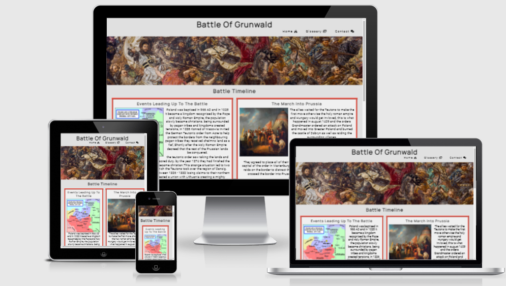
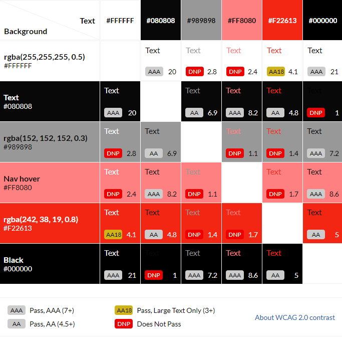
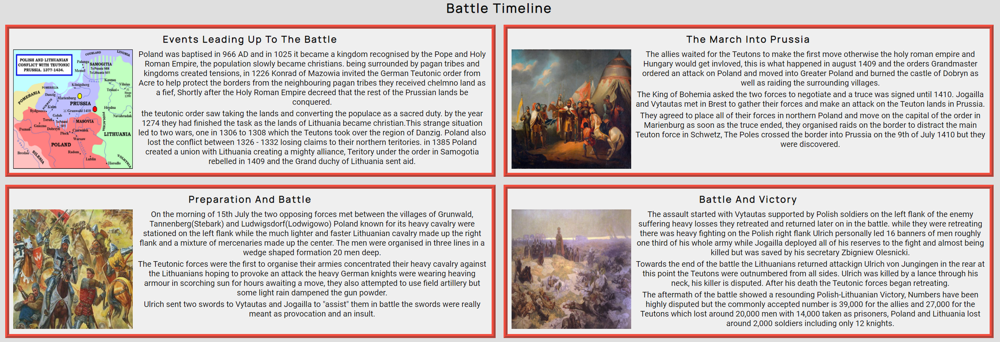
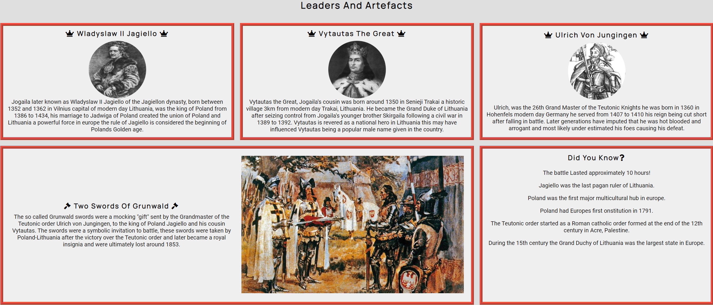
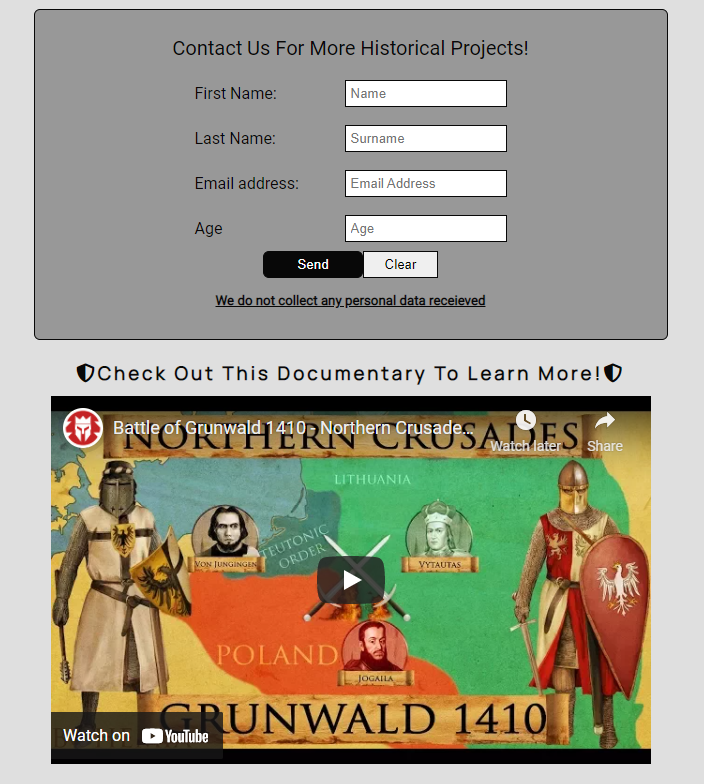

#   Battle of Grunwald 
## Historic battle between Poland-Lithuania and Teutonic Order
 

### This project is for educational purposes only

 

# Introduction 
 
 This website aims to educate on medieval facts and knowledge for users interested in the Battle of Grunwald
 an important event in the history of the region part of the "Northern Crusades".

 My goal is to create a functioning, responsive and informative site detailing an important event.
 

[Click Here To View The Site Live](https://matex600.github.io/Battle-of-Grunwald/) 

I recommend opening any links with CTRL + Left mouse button.

 # UX
The purpose of my project is to create a front-end only website for an event in history, which is regarded as an important battle in the history of Poland and Lithuania. 
My target audience for this project are users interested in the medieval history of the region.

## User Stories
* New users looking to.

    1. As a new user I want to access easily read information.
    2. As a new user I want to access the different pages consistently via navigation.
    3. As a new user I want to find out more with social media and embed video links
    4. As a new user I want to learn about the event and its history.
    5. As a new user I want to easily contact the page to find out more.
    6. As a new user I want to easily view images and consistent content layout.

* Returning users looking to.
    
    1. As a returning user I want to see new content.
    2. As a returning user I want to see layout and style improvements.
    3. As a returning user I want to see new social links and resources.
    4. As a returning user I want to be directed to new projects.
    5. As a returning user I want to engage in more ways with the website.

### I have included the following for my target audience

* A landing page with facts, images and information.
* A glossary page with important leaders, an artefact and fun facts.
* A contact page with a contact form and embedded video.
* A header with Title, hero-image and navigation bar across all pages.
* A Footer with Social links and image across all pages.

# Site Design

## Composition
* The Manrope font is used for headings in the site.
* Roboto font is used for the main text as it compliments Manrope, I also have a fall back of sans-serif as this is a general font that works well and is easy to read.
* Font Colour I have used is #080808 for headings and text.
* Images that have been used fit with the purpose of my site and the event and time period displayed.
* Font size for the site is larger than normal for most sections this is why I was happy with the contrast ratio below.

## Colour Scheme
* #080808 For text in body across the whole page to keep consistency.
* rgba(152, 152, 152, 0.3); For overall site background with a 0.3 transparency to reduce intensity.
* #ff8080 For hover function on navigation bar to enable user to see where they hover.
* #989898 For form background-color to make the form stand out.
* rgba(255,255,255, 0.5); For div elements in index.html and glossary.html to improve visibility and design.
* Using #080808 colour text against rgba(152, 152, 152, 0.3); background I have a contrast ratio AA 6.9:1 pass for accessibility.
* I created my colour scheme in hex but I wanted to have specific opacity, instead of two lines of code I changed them to rgba values

# Site Features

## Combined Pages
### Title

* The title indicates what the page is about at a glance.
* The title is responsive across Desktop, Tablet and Mobile.

### Navigation

* Includes a responsive navigation bar with Font icons.
* Has hover function to help user know location of cursor.
* Fully responsive across Desktop, Tablet and Mobile

### Social media and footer image

* The footer shows an appropriate image to the time period
* Social media links for twitter, facebook, instagram, youtube and wikipedia.
* Includes logos for respective links.
* Social Links open in new tabs to improve UX.

### Hero image

* Every page shares the same image to keep the website consistent.
* This image was picked due to portraying important historic characters 
and is part of the visual storytelling for the site letting users imagine what they are reading.

### Home Page 

* The home page contains the battle timeline and useful information as well as facts.
* Grid-box layout has been used to help the content stay responsive across multiple screen sizes.
* The home page is presented as a grid of two columns and two rows and is reduced to one column and one row with smaller device screens such as mobile to aid in viewing.
* Appropriate images have been used in each section to keeping in theme with the battle and timeline.

### Glossary Page

* The Glossary page shows important characters for Poland, Lithuania and the Teutonic order.
with icons, images, facts and information about the characters.
* The Glossary page shows the Two swords of Grunwald artefact presented to Poland and Lithuania as a mocking gift.
* The Glossary page has a "did you know?" section showing some interesting facts for the time period.
* The page uses Grid-box to help with responsiveness as the number of columns reduce according to screensize.

### Contact Page

* The contact page includes a contact form to be notified about future content.
* The contact page contains an well put together embedded video made by Kings and Generals relating to the Battle of Grunwald and can help further knowledge for someone that prefers a moving visual representation.
* The contact page is fully responsive across Desktop, Tablet and Mobile.

# Technologies Used

## Coding Languages
* [HTML5](https://en.wikipedia.org/wiki/HTML5 "Wikipedia page for HTML5 Coding Language"). - This makes the site work.

* [CSS3](https://en.wikipedia.org/wiki/CSS "Wikipedia page for CSS3 Styling Language") - This styles the site.

## Libraries and Tools 
* [Google Fonts](https://fonts.google.com "I used Google Fonts for fonts on my site")

* [Font Awesome](https://fontawesome.com/ "The Free version of Font Awesome has provided me with cool font additons")

* [Diff Checker](https://www.diffchecker.com/# "I used diffchecker to check my code")
* [Git Hub](https://github.com/ "I used git hub to store and release my project")
* [Git Pod](https://www.gitpod.io/ "I used git pod to create and write my code for the project")
* [amiresponsive](http://ami.responsivedesign.is/ "I used amiresponsive to check if my site is compatible with different resolution and devices")
* [Lighthouse](https://developers.google.com/web/tools/lighthouse "I used this developer tool for chrome to check quality and responsiveness")

# Testing

## Validation 

### Html

* [W3C Markup Validation Service](https://validator.w3.org/ "This was used to validate my HTML5")
  * [Index](https://validator.w3.org/nu/?doc=https%3A%2F%2Fmatex600.github.io%2FBattle-of-Grunwald%2Findex.html) - Index.html Results
  * [Glossary](https://validator.w3.org/nu/?doc=https%3A%2F%2Fmatex600.github.io%2FBattle-of-Grunwald%2Fglossary.html) - Glossary.html Results.
  * [Contact]

* [W3C CSS Validation Service](https://jigsaw.w3.org/css-validator/ " This was used to validate my CSS")

### Devices

#### I visually tested on these devices that I borrowed from friends and family.

 All elements showed up as they are supposed to aswell as being responsive and good performance in loading.
 Social media and navigation all worked as expected, Social media opened in a new tab,
 Text stayed inside containers and was well aligned.

* Iphone 12 pro max (1284 x 2778).
* iOS Safari
* Iphone 11 pro max (1242 x 2688).
* Chrome mobile
* Samsung S20 Ultra (1440 x 3200).
* Chrome mobile
* Samsung S10 (1440 x 3040).
* Chrome mobile
* Samsung S9+ (1440 x 2960).
* Chrome mobile
* One Plus 7 Pro (1440x3120).
* Firefox Mobile

#### Devices Used for testing within Google Chrome Dev tools.

I did not personally have these devices available to test with but within chrome dev tools they behaved the same as above.

* Moto G4.
* Galaxy S5.
* Pixel 2.
* Pixel 2 XL.
* Iphone 5/SE.
* Iphone 6/7/8.
* Iphone 6/7/8 Plus.
* Iphone X.
* Ipad.
* Ipad Pro.
* Galaxy Fold.
* Surface Duo.

### Browsers
   
* Google Chrome 
* Google Chrome Dev tools
* Firefox Browser
* Microsoft Edge
* Opera Web Browser
* ~~Internet Explorer 11~~

## Bugs
I encountered a bug whilst improving responsiveness for mobile devices, I found an edge case between 420 and 440 px I had a difficulty with one character dropping on my h3 tags in the glossary.html
 making it look less than desireable I fixed this by increasing the font size temporarily with a media query to make more than one character drop to slightly improve design as there might be phones
 with that px size in the future.

I had an issue testing my responsiveness on contact page with iphone 5/SE (320px) where the content inside the form would not align how I would like, I created a media query to change the width to auto and this change made it look more in line.

My site does not align properly on Internet explorer 11 as it has had support dropped on November 30th 2020 and will be fully discontinued on July

# Site Deployment

* The site was deployed to github Pages, below are the steps.
  1. In the github repository navigate to "settings"
  2. Scroll down to the "pages" tab
  3. In the github pages from the source drop down select main/master both are correct.
  4. Once you select main/master the page will automatically refresh and a link will be available
with succesful deployment.

Live link to the site -- [Battle of Grunwald](https://matex600.github.io/Battle-of-Grunwald/)--

# Credits

## Content
[Facts and Information](https://en.wikipedia.org/wiki/Battle_of_Grunwald "I used wikipedia for my information") - I used wikipedia for my information on the battle.

[Wladyslaw II Jagiello](https://en.wikipedia.org/wiki/W%C5%82adys%C5%82aw_II_Jagie%C5%82%C5%82o) - Information about Polish King.

[Vytautas the Great](https://en.wikipedia.org/wiki/Vytautas) - Information about Vytautas.

[Grunwald Swords](https://en.wikipedia.org/wiki/Grunwald_Swords) Information about Grunwald Swords.

[Ulrich Von Jungingen](https://en.wikipedia.org/wiki/Ulrich_von_Jungingen) - Information about Grandmaster of the Teutons.
## Media
[Hero Image](https://en.wikipedia.org/wiki/Battle_of_Grunwald#/media/File:Jan_Matejko,_Bitwa_pod_Grunwaldem.jpg "Image source") - Image source.

[Embedded Video](https://www.youtube.com/watch?v=VeBOJ0bAI6Q "Embedded video on contact page") - Embedded video on contact page.

[Footer Image](https://hdwallpaperim.com/historic-battle-of-grunwald-zalgirio-musis-lithuania-teutonic-battlefields-painting-poland/ "Footer Image") - Footer Image.

[Polish King](https://en.wikipedia.org/wiki/W%C5%82adys%C5%82aw_II_Jagie%C5%82%C5%82o#/media/File:Wladyslaw_Jagiello.jpg) - Portrait of Wladyslaw Jagiello by Jan Matejko.

[Lithuanian Grand Duke](https://www.pinterest.co.uk/pin/661958845209526399/) - Portrait of Vytautas the Great by Adomas Varnas.

[Two Grunwald Swords ](https://it.wikipedia.org/wiki/File:Wojciech_Kossak,_Dwa_miecze.jpg) - Wojciech Kossak 1909

[Ulrich von Jungingen](https://en.wikipedia.org/wiki/Ulrich_von_Jungingen#/media/File:Ulrich_von_Jungingen1.PNG) - Christoph Hartknoch Altes und Neues Preussen 1684

[March into Prussia](http://www.imperialteutonicorder.com/id41.html) - January Suchodolski - 1849

[Grunwald Battle](https://www.storiespreschool.com/images/battle_grunwald1.jpg)

[Aftermath of Battle](https://en.wikipedia.org/wiki/Battle_of_Grunwald#/media/File:After_the_Battle_of_Grunwald_-_Alfons_Mucha.jpg) - Alfons Mucha 1924
## Acknowledgment
 [Code Institute](https://codeinstitute.net/) - Teaching and preparing in HTML and CSS.

 [Kings and Generals](https://www.youtube.com/channel/UCMmaBzfCCwZ2KqaBJjkj0fw "Fantastic channel for historical content") - For content in embedded video and knowledge.

 [Youtube](https://www.youtube.com/) - For embedded video.

 [Grid box](https://css-tricks.com/snippets/css/complete-guide-grid/) - Helped me implement and improve responsive design.

 [Avex Design](https://avexdesigns.com/blog/responsive-youtube-embed) - Blog article on making youtube video responsive.

 [Favicon](https://www.favicon-generator.org/search/---/Swords) - I used this site to download and link a favicon to my site.
